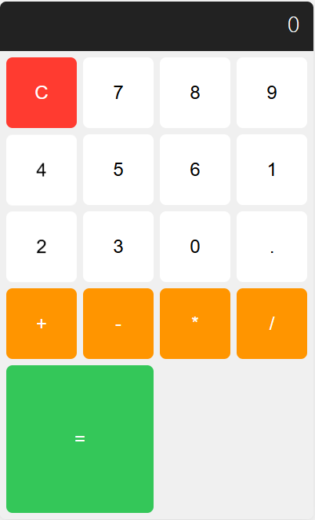

# Bright Solutions Agentic Project Builder 🤖🚀

Welcome to the **Bright Solutions Agentic Project Builder** repository! This innovative tool leverages AI agents to transform your ideas into fully functional projects. Simply describe what you want—be it a website, app, script, or any software solution—and our agentic system handles the end-to-end creation. From planning to coding, it generates the complete codebase, ready for you to run and test. No coding expertise required on your side! 

As a premier BPO and AI solutions provider, **Bright Solutions** offers this as a **custom service** to clients. We tailor the agent to your specific needs, deploy it seamlessly, and ensure it delivers high-quality, production-ready outputs. Whether you're a startup, enterprise, or individual, let's turn your vision into reality. 🌟

  
*(Overview of our LangGraph-based workflow: Starting from your prompt, it flows through Planner → Architect → Coder, ensuring structured and efficient project generation.)*

  
*(Example output: A colorful, modern calculator app built entirely by the agent from a simple user prompt like "Build a basic calculator in HTML, CSS, and JS.")*

## Why Choose Our Agentic Project Builder? 💡

Our system stands out with:
- **Intelligent Automation**: Uses advanced AI agents to plan, architect, and code your project autonomously.
- **End-to-End Delivery**: Generates complete, runnable code—no partial sketches or placeholders.
- **Flexible Tech Stack**: Defaults to LangGraph for orchestration, but we can switch to Crew AI or other frameworks per your needs.
- **Custom LLMs**: Powered by Groq (e.g., `openai/gpt-oss-120b`), with options to integrate Anthropic, OpenAI, Gemini, xAI, or others for optimal performance.
- **Secure & Efficient Tools**: Includes file I/O, directory management, and command execution, all sandboxed for safety.
- **Friendly & Professional**: Outputs are clean, well-structured, and easy to understand, with built-in error handling.

This repo demonstrates our capabilities—contact us to build a customized version for your business! 😊

## Key Features 🔑

- **User-Friendly Prompting**: Input your requirements in natural language (e.g., "Build a colorful modern todo app in HTML, CSS, and JS").
- **Structured Workflow**:
  - **Planner**: Converts your prompt into a high-level plan (name, description, tech stack, features, files).
  - **Architect**: Breaks the plan into detailed tasks with dependencies and integration details.
  - **Coder**: Implements each task using tools like file writing/reading, ensuring compatibility.
- **Output Testing**: Generated projects are stored in a dedicated folder (e.g., `./generated_project`), ready to run.
- **Recursion Limit**: Configurable to handle complex projects without infinite loops.
- **Extensibility**: Easily adapt for web apps, scripts, data tools, or more.

## How It Works ⚙️

1. **Input Your Prompt** 📝: Describe your project via command-line or API.
2. **Agent Processing** 🧠:
   - **Planner Agent**: Creates a structured `Plan` with tech stack, features, and files.
   - **Architect Agent**: Generates a `TaskPlan` with sequential implementation steps.
   - **Coder Agent**: Uses ReAct-style tooling to write code step-by-step, reviewing existing files for consistency.
3. **Output Generation** 📂: Files are created in a safe project root. Run them directly (e.g., open HTML in a browser).
4. **Customization**: We adjust frameworks, LLMs, or add features like database integration during service setup.

This agentic approach ensures reliable, high-quality results every time!

## Getting Started as a Client 👥

We're here to make this effortless for you:
1. **Contact Us**: Share your project ideas via phone (+1 (832) 390-6434 or +92 333-316-7749) or email (info@brightssolution.com).
2. **Discuss Requirements**: Tell us your tech preferences (e.g., switch to Crew AI or OpenAI LLM).
3. **We Build & Deploy**: Get a customized agent, API access, or hosted solution.
4. **Test & Iterate**: Run your generated projects and request tweaks.

No setup needed—we handle it all! 🚀

## Installation & Setup (For Developers) 🛠️

Explore the code yourself:
1. **Clone the Repo**:
   ```
   git clone https://github.com/BrightsSolution/AutoCoder.git
   cd AutoCoder
   ```
2. **Install Dependencies**:
   - Python 3.10+: `uv add -r requirements.txt` (includes LangChain, LangGraph, Groq, Pydantic, etc.).
3. **Set Environment Variables**:
   - Add `.env` with `GROQ_API_KEY=your_key`.
4. **Run the Agent**:
   ```
   python main.py
   ```
   - Enter your prompt when asked.
   - Use `-r 200` for deeper recursion if needed.

## Customization Options 🎨

Tailor to your exact needs:
- **Framework Switches**: LangGraph (default) to Crew AI or others for different orchestration styles.
- **LLM Providers**: Groq, Anthropic, OpenAI, Gemini, xAI—choose for cost, speed, or accuracy.
- **Advanced Features**: Add testing tools, CI/CD integration, or multi-language support.
- **Scalability**: Handle larger projects with enhanced recursion or cloud deployment.

Just specify during our consultation!

## Contributing & Support 🤝

This is a demo repo—reach out for custom implementations or feedback. Let's collaborate to build smarter solutions!

- **Phone**: +1 (832) 390-6434 | +92 333-316-7749
- **Email**: info@brightssolution.com
- **Website**: [brightssolution.com](https://brightssolution.com)

Thanks for checking out Bright Solutions Agentic Project Builder. Let's create something extraordinary together! 🌐✨